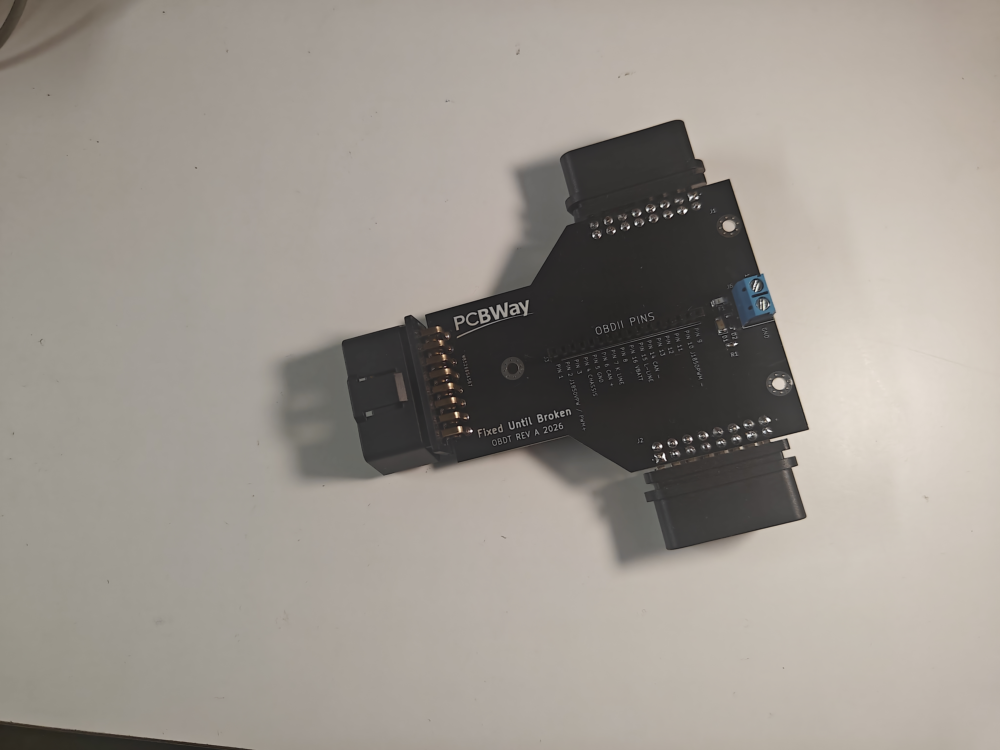

# The OBDT
OBD2 splitter for testing and troubleshooting all your OBDII problems. This tool can also be useful for reverse engineering. 
This Project is sponsored by PCBWay! Whether you need prototype PCBs or full assembly, PCBWay delivers high quality at a great price. Check them out at pcbway.com

## Gerbers
They are in the compressed folder

## Video 

